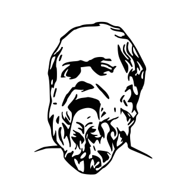

# ZoKrates

[](https://gitter.im/ZoKrates/Lobby?utm_source=badge&utm_medium=badge&utm_campaign=pr-badge&utm_content=badge)
[](https://circleci.com/gh/Zokrates/ZoKrates/tree/develop)

ZoKrates is a toolbox for zkSNARKs on Ethereum.

_This is a proof-of-concept implementation. It has not been tested for production._

## Getting Started

Load the ZoKrates Plugin on [Remix](https://remix.ethereum.org) to write your first SNARK program!

Alternatively, you can install the ZoKrates CLI:

```bash
curl -LSfs get.zokrat.es | sh
```

Have a look at the [documentation](https://zokrates.github.io/) for more information about using ZoKrates.
[Get started](https://zokrates.github.io/gettingstarted.html), then try a [tutorial](https://zokrates.github.io/examples/rng_tutorial.html)!

## Getting Help

If you run into problems, ZoKrates has a [Gitter](https://gitter.im/ZoKrates/Lobby) room.

## License

ZoKrates is released under the GNU Lesser General Public License v3.

## Contributing

We happily welcome contributions. You can either pick an existing issue or reach out on [Gitter](https://gitter.im/ZoKrates/Lobby).

Unless you explicitly state otherwise, any contribution you intentionally submit for inclusion in the work shall be licensed as above, without any additional terms or conditions.

### Git Hooks

You can enable zokrates git hooks locally by running:

```sh
git config core.hooksPath .githooks
```

### `{js,json,ts}` formatting

We enforce strict formatting of `.{js,json,ts}` files in CI. This check is not included in the git hooks. If you modify such a file, you can ensure its formatting is correct by running:

```
npm i -g prettier
prettier --write "./**/*.{js,ts,json}" --ignore-path .gitignore
```
